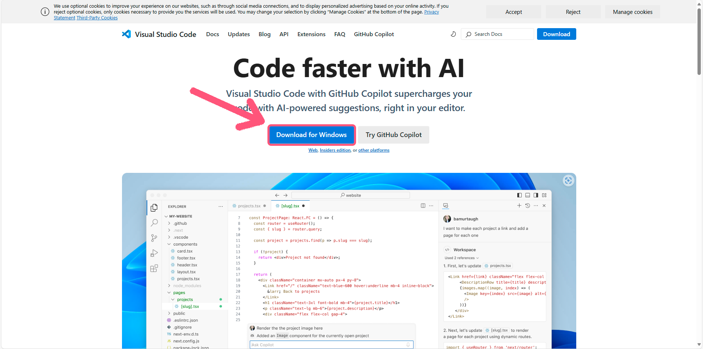
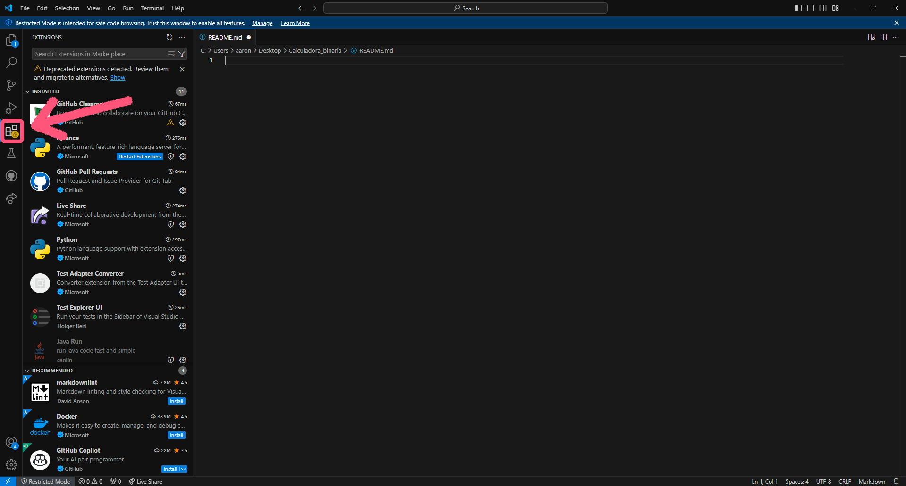
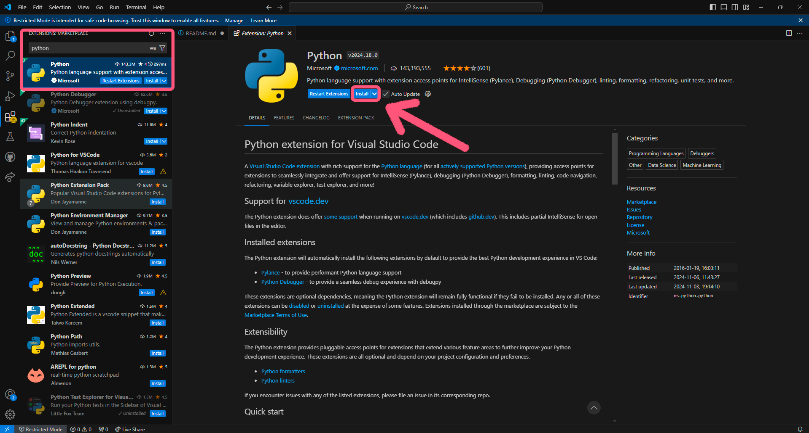
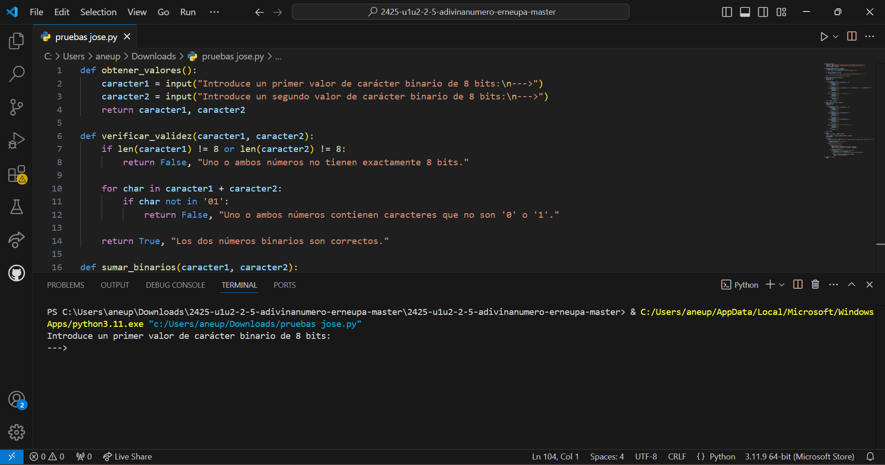

# CALCULADORA BINARIA

## Para ejecutar el programa de la calculadora binaria, creada por Aarón Neupaver Montiel, deverás seguir los pasos que le dejo por aquí abajo:

Como en cada sistema operativo, se requieren ciertos requisitos para poder ejecutarlo, vamos a instalarnos *Visual Studio Code*. Es un entorno de desarrollo que nos va 
a facilitar mucho a la hora de programar, debido a todas sus funciones y su claridad de representar un texto adquiriéndoles colores. A demás de todo eso, tenemos la 
posibilidad de descargarnos plugins y para este caso, nos descargaremos uno para poder ejecutar nuestro programa desde la propia terminal de dicho IDE, y sí, también 
tiene una consola.

### Para instalarlo, es muy simple, adjunto para diferente sistema operativo.

__·Windows:__ Para Windows, entraremos en la siguiente página web ['PULSE AQUÍ'](https://code.visualstudio.com/), una vez dentro, veremos algo similar a esto.

Y le daremos al botón de descargar como viene marcado en la imagen adjuntada, cuando esté descargada, entramos y yasta.

__·Linux :__ En este caso es algo diferente, lo primero que haremos es como arriba, entraremos en la web y descargaremos nuestro archivo pero para Linux y cuando se nos 
instale, iremos a nuestra consola de Linux y entraremos en la ruta donde la hemos descargado, para a continuación escribir este comando *sudo apt-get install nombre_paquete*.

### Plugin de Python.

Una vez dentro, no importa que sistema operativo, vamos a irnos al apartado de extensiones.

Una vez aquí, buscaremos el plugin de Python y lo instalaremos.

Ya estaría todo preparado para ejecutarlo.

### Ejecución.

Para ejecutarlo, es muy simple, en la esquina superior derecha, aparecerá un pley, el cual pincharemos sobre el y se nos ejecutará en una pequeña terminal que aparece debajo de nuestro codigo.

